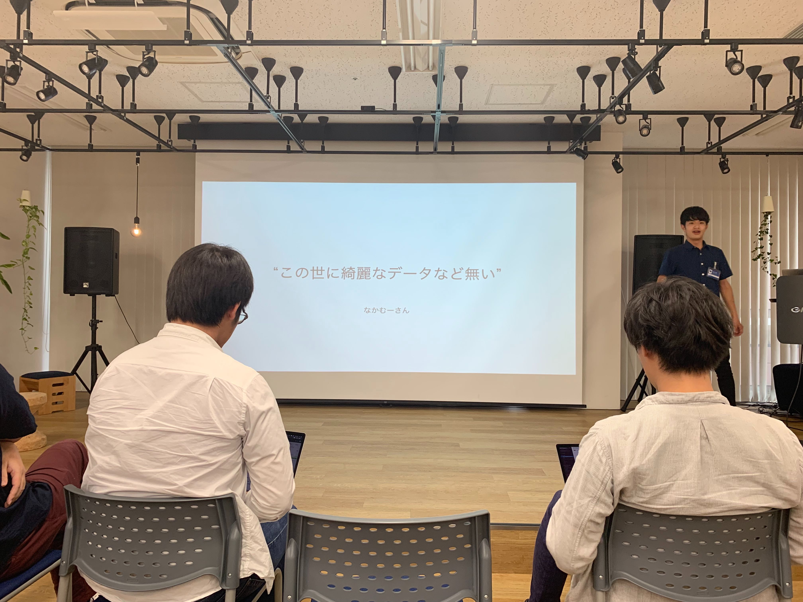

GMOペパボ株式会社(以下ペパボと表記させていただく) 福岡オフィスの2019年 夏インターンシップに参加した。  
2019/8/21から2019/8/30の平日8日間、ムームードメインチームのフロントエンドエンジニアとして開発させていただいたので、その記録である。

オフィスの入口。

インターンシップ最終日にパートナーさん[^1](#annotation-1)の前で成果発表会をしたのだが、話しきれなかった部分もあるのでそれを消化する意味もある。
長文失礼したい。

## ペパボとムームードメイン

### ペパボとは

> GMOペパボ株式会社（ジーエムオーペパボ、英文社名 GMO Pepabo, Inc.）は、東京都渋谷区桜丘町に本社、福岡県福岡市中央区に支社を置くインターネット関連サービスを提供する会社である。 ([wikipedia](https://ja.wikipedia.org/wiki/GMOペパボ)より引用)

「インターネットで可能性をつなげる、ひろげる」をミッションに、インターネットで個人の表現活動をする人を支援するサービスを展開している。
レンタルサーバー「ロリポップ」、ハンドメイドマーケット「minne」等のサービスがある。

丁度インターンシップ期間中に企業紹介動画[^2](#annotation-2)が公開された。( [別ver](https://twitter.com/achamixx/status/1167253538595954688)もある。)

<iframe width="560" height="315" src="https://www.youtube.com/embed/ANXs_ZdQtt4" frameborder="0" allow="accelerometer; autoplay; encrypted-media; gyroscope; picture-in-picture" allowfullscreen></iframe>

ちなみに私はインターンシップでDiscover New Something[^3](#annotation-3)した。

福岡オフィスではホスティング系サービスの開発を行っていて、今回はその中のムームードメインチームに参加させていただいた。

### ムームードメインとは

> 「ムームードメイン」は、国内最大級の独自ドメイン取得サービスです。400種類以上の豊富なドメインの中から、欲しいドメインがきっと見つかります。取得後はホームページをすぐに作成できるサービスも提供。まずはドメイン検索から。 ([ムームードメイン](https://muumuu-domain.com)より引用)

ドメイン取得サービスとして、ペパボの中でも古くから続いているサービスの一つ。自分も利用している。

## インターンシップでしたこと

Nuxt.jsで作られているページへの機能追加を行った。

[ドメインの価格一覧ページ](https://muumuu-domain.com/domain/price)に価格によるソート機能を追加した。
ドメイン一覧表のヘッダ箇所にボタンが追加され、昇順・降順ソートが出来るようになった。

<blockquote class="twitter-tweet">
価格一覧のドメインを新規取得、更新、移管の価格順に並び替えることができるようになりました。ご予算に合ったドメインを見つけやすくなります。<a href="https://t.co/QL670SQXx0">https://t.co/QL670SQXx0</a> <a href="https://t.co/wLcWnas2Cm">pic.twitter.com/wLcWnas2Cm</a>
&mdash; ムームードメイン (@muumuu_domain) <a href="https://twitter.com/muumuu_domain/status/1169492805137256449?ref_src=twsrc%5Etfw">September 5, 2019</a></blockquote> 

他のインターン参加者は次のようなことをやっていたようだ。各々のスキルに合わせて、チームに配属され実際の業務に加わる形式でインターンシップが進む。

- 研究所でデータ解析
- CIツール周りをごにょごにょ
- Webサービスに機能追加
- APIを書く

## 学んだこと - 技術の話

### コードリーディング

今回のインターンシップでは新たなページの追加ではなく既存ページへの機能追加を行ったことから、既に完成しているドメインの価格を表示するロジックに手を加えることになった。
既存の実装の意図を汲みながら、他ページへの影響を与えないよう設計することに注意した。

コードを呼んでロジックとデータの流れを追う経験が少なかったので、コードを読むのは面白いと感じるとともに、実装の意図を汲むのが結構難しかった。似たような機能を持つOSSライブラリも見てみたりしながら設計を固めた。

かの有名なお言葉。

### 実際に動いているサービス

サービスの規模感、エンジニアや関わる人の人数、サーバーの構成や使用されている技術スタックを見れた。1つのサービスを俯瞰して、どうやって動いているのかをしれたのは貴重な経験である。  
デザイナーさんとの分業の仕方や、ディレクターさんとの仕様の確認など、チームとしてサービスを支えている姿をみれた&経験できた。

### issueとPullRequest

恥ずかしながらチーム開発を今夏まで経験してこなかったので、GitHubのissueとPullreqを使う機会がなかった。
ソフトウェアの実装に関する相談やまとめ、記録としても非常に有用で期間中たくさんお世話になった。

コードレビューは学ぶことがとても多く、これからの自分のコードにたくさん取り入れていきたい。(既に恩恵を享受している。あらみそさんありがとうございます。)

PullRequestを出す際に参考にしたいのがこちら↓。私が出したプルリクがこれにどこまで沿えていたかはおいておいて(笑)、自戒の念としても今後の参考のためにも残しておく。
特に私のようなプルリク歴の浅い方にお勧めしたい。

  
参照元: [ぼくのかんがえたさいきょうのPullRequest](https://kimromi.github.io/2017-08-31/pull-request.html)

### テスト

個人で開発しているとテストを書くという発想に至らず、今までテストを書いてこなかった。そのため、今回のインターンシップでテストを書いたのもとても良い経験だった。
Nuxt.jsのコンポーネントを自在に手のひらで転がせるよう、転がれ転がれと念じながら過ごした(嘘)。

テストを書くといいことが沢山ある。他人のためになるだけでなく、既存の実装や構造を振り返るいい機会にもなるし、自分がのちに実装するときに恩恵(正しい動作を保証できる[^4](#annotation-4))を享受できる(した)。

## 感じたこと - ペパボの話

ペパボは次の[「わたしたちが大切にしている3つのこと」](https://recruit.pepabo.com/info/important/)を掲げている。

- みんなと仲良くすること
- ファンを増やすこと
- アウトプットすること

パートナー皆さんにこれが浸透していて、日々実践されているのを感じた。

### みんなと仲良くすること

まずパートナーさんが優しい。インターン生に対してだけでなく、職種や上下関係、チームの壁を超えてそれぞれが仲が良い(いい距離感だ)と感じた。
インターンシップ期間中、私をインターン生と知らないパートナーさんが声をかけてくださってお話したり、社内のシニアエンジニアの方に実装について聞いたりなど、いろんなパートナーさんと接する機会があったがどの方も親切だった。

  
サポーターのづっきーさんに助けられている姿。づっきーさんにも沢山仲良くしてもらった。沢山助けられた。

### ファンを増やすこと

会社やサービスを好きな人が多い。(観測範囲において。) しかし、私が感じたのは会社のファンだけでなく、パートナーさんに惹きつける魅力があるということが、ファンを増やすことなのではないかと思った。

  
インターン生が貰えるsuzuri[^5](#annotation-5)のキャラクター「スリスリくん」のぬいぐるみ。非売品でパートナーさんも簡単には手に入れられないらしい。

### アウトプットすること

開発でGitHub Enterpriseを利用しており、issueやPullreqもアウトプットの形だと思う。
そこに過去の経緯が残されていることで、今回も開発の資料としてとても参考になった。

インターンシップ中に紹介された参考資料がパートナーさんが社外に公開したスライドだったり([先程のさいきょうのPullReq](#issueとPullRequest)もその一つ)、パートナーの方が登壇する技術イベントに参加させていただいたり、アウトプットされているのを肌に感じた。

LT経験の浅い私のためにLTの機会を増やして頂き、インターンシップ期間中に合わせて3回発表をした。issueもPullreqも書いたし、私もパートナーさんを見習ってもっとアウトプットしていきたい。

  
メダロットについて熱く語るパートナーのてっしーさん。技術以外でもアウトプット。

## 感じたこと - 福岡の話

人生初の九州上陸だったが、福岡は住みやすそうな街だった。

### コンパクトシティ

空港から街が近い、というよりも街に空港があるので移動が楽。(成田空港、お前のことだぞ。[^6](#annotation-6))

### 食べ物が美味しい

ペパボの福岡インターンシップで、日報にご飯が美味かったと書かれるのはあるあるらしい。もちろん私も書いた。
一つ一つ紹介しているとそれだけで記事になってしまうので、写真でまとめて振り返る。

帰りに空港でお土産をみて、明太子とごまさばを食べそびれたことに気づいた。

## まとめ

とてもざっくりまとめると、今回のインターンに参加してとても良かった。  
応募前は、自分の技術力が通用するのか不安だった。
しかし、ペパボの皆さんは本当に優しくて、丁寧にフォローしてくれるので、沢山の学びとともに期間中になんとか機能をリリースできた。

また同じ期間に他チームへ配属されていたインターン生にもよい刺激を受けた。同年代の強い人すごい。みんなすごい。

次は冬にも同様の就業型インターンシップを予定しているそうなので、この業界を考えてる人にぜひ勧めたい。

## おわりに

インターンシップ中に関わらせていただいたた皆さんにとてもお世話になりました。
特にサポーターのづっきーさんには技術面で沢山サポートしていただきました。初日緊張してパスワードを永遠にtypoしていたのが懐かしいです。  
本当にありがとうございました。

パートナーさんと我々インターン生。最高の夏。

[^1]: ペパボで働く人のこと

[^2]: 正確にはペパボ協賛の技術イベント[builderscon2019](https://builderscon.io)の幕割CM

[^3]: 記事中の[動画](https://www.youtube.com/watch?v=ANXs_ZdQtt4)を参照。buildersconのコンセプトらしい。(インターンシップとbuildersconに直接の関係はない。)

[^4]: もちろん、テストはテストコードとして書かれた動作しか保証できないので、ある程度正しい動作を保証できるようなテストを書くこと、テストで何が保証されているのかを理解しておくことが必要がある。

[^5]: ペパボが運営するオリジナルグッズの作成・販売サービス。[suzuri](https://suzuri.jp)。

[^6]: さいたまに住んでいると羽田も遠い。

